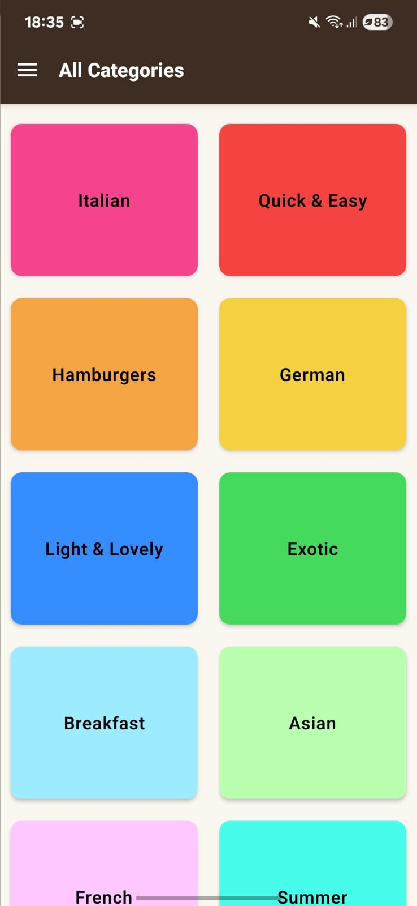
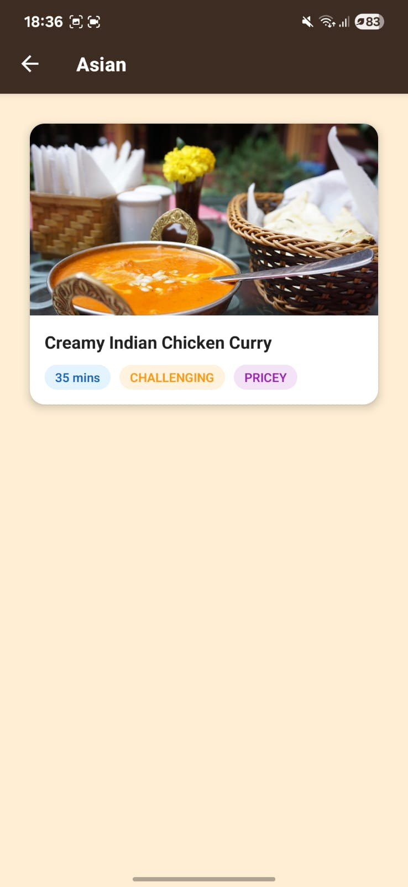
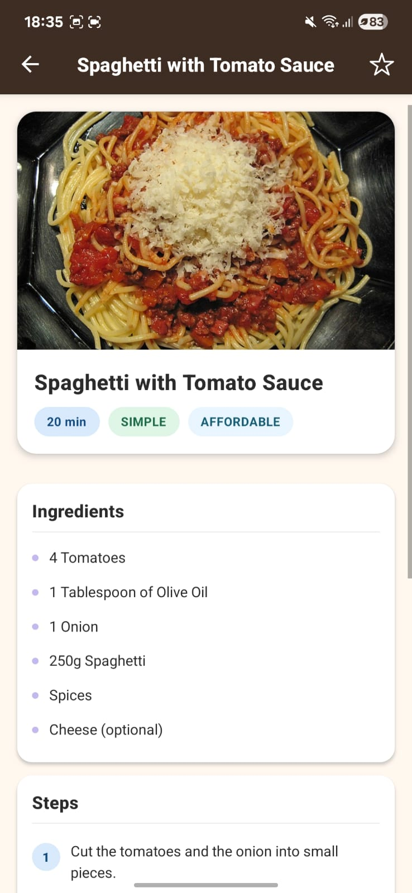
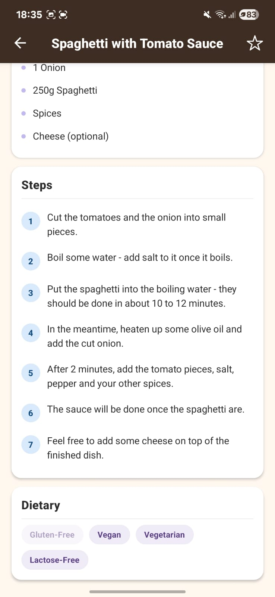
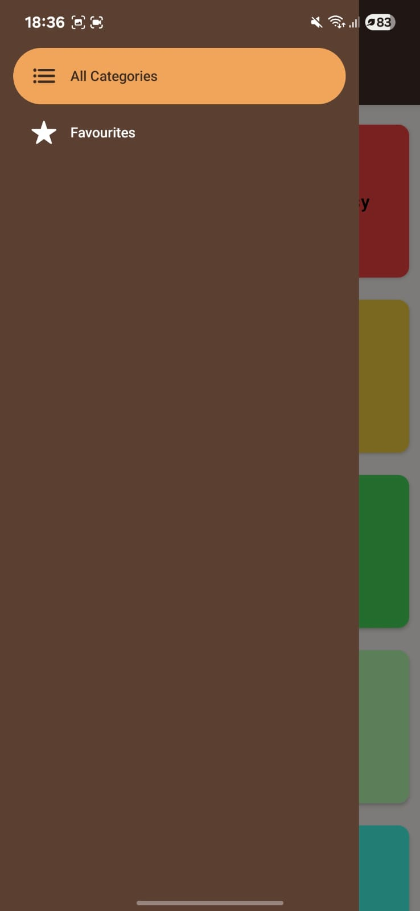
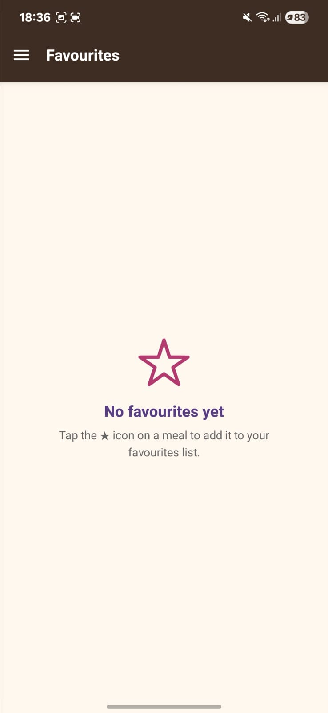
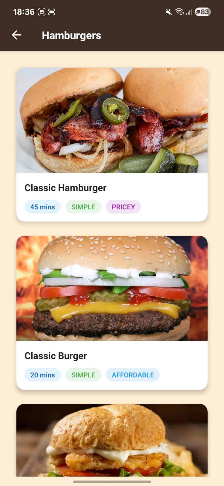
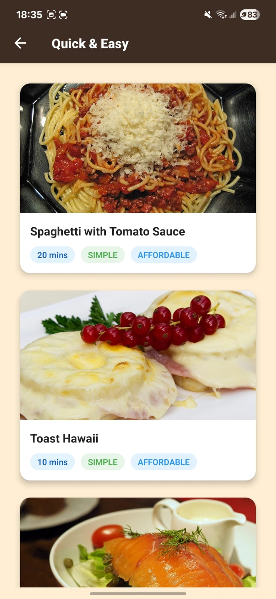

# 🍽️ Favourite Meals App (React Native + Expo)

A learning project built with **React Native** and **Expo**, where I explored the fundamentals of mobile app development, navigation, and state management in React.

This app allows users to browse a list of meals, view details, and mark their favourites.  
It was designed as a personal learning project, but it also serves as a solid starter template for anyone beginning their React Native journey.

---

## ✨ Features

- **Browse Meals** — Display meals with images, titles, and details.
- **Meal Detail View** — Scrollable, styled screens showing ingredients, steps, and dietary info.
- **Mark as Favourite** — Toggle favourites with a star icon and view them in a dedicated screen.
- **Stack + Drawer Navigation** — Combination of navigators using `react-navigation` for smooth user flow.
- **Context API State Management** — Share favourite state across screens without prop drilling.
- **Responsive & Styled UI** — Use of pastel-themed colors, custom styles, and reusable components.

---

## 📚 What I Learned

This project was my **entry point into the React Native world**.  
Some of the key concepts and tools I learned while building this:

### 🖌️ React Native UI Elements
- `View`, `Text`, `Pressable`
- `FlatList`, `ScrollView`
- `StatusBar`, `SafeAreaView`

### 🧭 Navigation
- `react-navigation`
- Stack Navigator
- Drawer Navigator
- Combining navigation types for a better UX

### ⚛️ React Concepts Refreshed
- **State management** with `useState`
- **Context API** for global state
- **useLayoutEffect** for customizing screen headers dynamically

---

## 🛠️ Tech Stack

- **React Native** (via [Expo](https://expo.dev/))
- **React Navigation** (Stack + Drawer)
- **Context API** for global state
- **Ionicons** for icons
- **JavaScript (ES6+)**

## 📸 Screenshots

Below are some snapshots from the Meals App I built while learning React Native & Expo.

### 🏠 All Categories

### 🍜 Asian Meals

### 📄 Meal Detail (Example 1)

### 📄 Meal Detail (Example 2)

### 🍔 Drawer Navigation

### ⭐ Favourites Screen

### 🍽️ Hamburger Meals

### ⚡ Quick Meals

---

